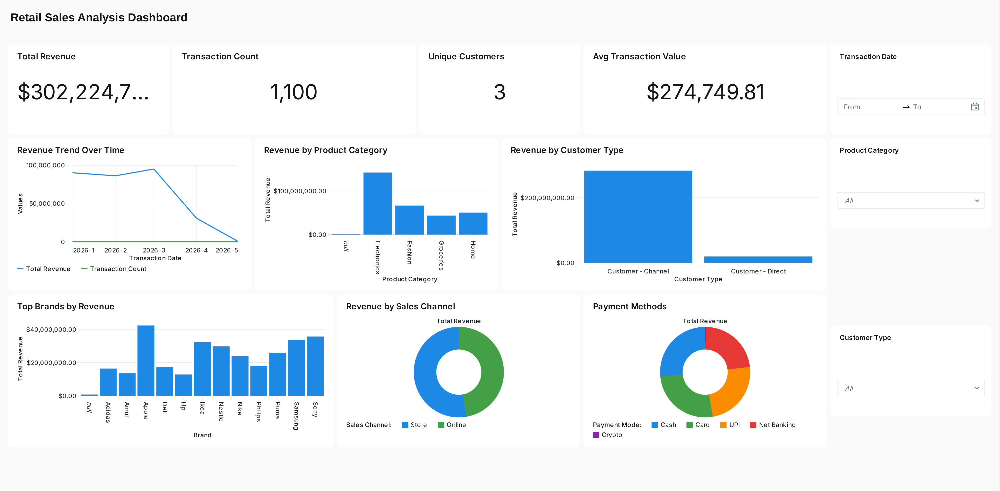

# RetailQ — Retail Analytics Lakehouse

A multi-source retail analytics lakehouse on Databricks — integrating Salesforce (accounts, opportunities), Postgres (product catalog, inventory), and blob transaction files into a Bronze/Silver/Gold medallion architecture, with a Unity Catalog Metric View semantic layer and a Databricks SQL dashboard on top.



📄 Full PDFs: [Sales Analysis Dashboard](dashboard/Retail_Sales_Analysis_Dashboard.pdf) · [Visualization Showcase](dashboard/Retail_Dataset_Visualization.pdf)

## Architecture

```
Salesforce (accounts, opportunities)     Postgres (product_catalog, inventory)     Blob CSVs (transactions)
     via Lakeflow Connect                     via Lakeflow Connect                  via Auto Loader
              │                                        │                                    │
              ▼                                        ▼                                    ▼
   salesforce_bronze.*                      postgres_bronze.*                    blob_bronze.transactions
              │                                        │                                    │
              ▼                                        ▼                                    ▼
   retail_silver.account                   retail_silver.product_catalog        retail_silver.transactions
   retail_silver.opportunity               retail_silver.inventory
              │                                        │                                    │
              └───────────────────┬────────────────────┴────────────────────────────────────┘
                                   ▼
                        retail_gold.fact_sales
                     (transactions ⋈ opportunities)
                                   ▼
                ┌──────────────────┴──────────────────┐
                ▼                                      ▼
   dim_customer / dim_product / fact_inventory   retail_semantic.retail_metrics
        (Gold Views)                          (Unity Catalog Metric View)
                                   │
                                   ▼
                    Databricks SQL performance dashboard
```

Salesforce and Postgres sources sync into bronze via **Databricks Lakeflow Connect** — no manual ingestion script needed, Lakeflow Connect handles the CDC/schema natively. Only the blob transaction files land as flat CSVs, so those go through an **Auto Loader** ingestion notebook instead.

## Medallion Layers

| Layer | Table | Source | What it does |
|---|---|---|---|
| Bronze | `salesforce_bronze.account` | Salesforce (Lakeflow Connect) | Raw account records |
| Bronze | `salesforce_bronze.opportunity` | Salesforce (Lakeflow Connect) | Raw opportunity records |
| Bronze | `postgres_bronze.product_catalog` | Postgres (Lakeflow Connect) | Raw product catalog |
| Bronze | `postgres_bronze.inventory` | Postgres (Lakeflow Connect) | Raw inventory records |
| Bronze | `blob_bronze.transactions` | Blob CSVs (Auto Loader) | Raw transaction records |
| Silver | `retail_silver.account` | — | Cleaned account fields, uppercased/trimmed names, `is_active` flag |
| Silver | `retail_silver.opportunity` | — | Cleaned opportunity fields |
| Silver | `retail_silver.product_catalog` | — | Standardized categories/brands, price segmentation, SCD-style `is_active` flag |
| Silver | `retail_silver.inventory` | — | Cleaned inventory with a derived `LOW_STOCK`/`HEALTHY` status |
| Silver | `retail_silver.transactions` | — | Parsed transaction fields |
| Gold | `retail_gold.fact_sales` | — | Transactions joined to opportunities, with real per-transaction revenue |
| Gold | `retail_gold.dim_customer`, `dim_product`, `fact_inventory` | — | Analytics-ready dimension/fact views |
| Gold | `retail_gold.dim_calendar` | — | Date dimension table |
| Semantic | `retail_semantic.retail_metrics` | — | Unity Catalog Metric View — governed metrics layer with Genie-ready synonyms |

## Data Quality

Every silver transform uses Lakeflow Declarative Pipeline `@dp.expect` / `@dp.expect_or_drop` / `@dp.expect_or_fail` decorators — `expect_or_drop` silently drops failing rows, `expect_or_fail` halts the pipeline on failure, `expect` reports a pass-rate metric without dropping rows.

## Semantic Layer

`retail_metrics.sql` defines a **Unity Catalog Metric View** — a governed, YAML-defined semantic layer sitting on top of `fact_sales`, joined to `dim_product`, `dim_calendar`, and `dim_customer`. Every dimension carries natural-language synonyms (e.g. "revenue" / "sales" / "total sales" all resolve to the same measure) so Genie can answer conversational questions against the data without needing a hand-written SQL query.

## Technical Notes

While reviewing the pipeline, two things were tightened up:

- **Calendar dimension naming** — standardized the calendar table's name (`dim_calendar`) to match the Metric View's join reference and the naming convention used by the other dimension tables (`dim_customer`, `dim_product`).
- **Revenue calculation** — `fact_sales` computes revenue directly from each transaction's line-item fields (`selling_price × quantity − discount_amount`), rather than carrying forward a joined field from the opportunity record.

Note: this is a practice/skill-building project, and the underlying source data gets regenerated periodically as part of that practice. The dashboard screenshots below reflect a specific data snapshot at the time they were captured — re-running the pipeline against current data will produce different figures.

## Project Structure

```
retailq-project/
├── dashboard/
│   ├── dashboard_overview.png         # Embedded in this README
│   ├── Retail_Sales_Analysis_Dashboard.pdf
│   └── Retail_Dataset_Visualization.pdf
├── bronze/
│   └── 01_blob_to_bronze.ipynb        # Auto Loader ingestion for blob transaction CSVs
├── silver/
│   ├── account.py
│   ├── opportunity.py
│   ├── product_catalog.py
│   ├── inventory.py
│   └── transactions.py
├── gold/
│   ├── fact_sales.py                  # Corrected revenue calculation
│   ├── 02_Gold_Views.ipynb            # dim_customer, dim_product, fact_inventory
│   ├── dim_calendar.sql               # Calendar dimension (naming fix applied)
│   └── retail_metrics.sql             # Unity Catalog Metric View
├── source_data/
│   ├── 03_salesforce_accounts_history.csv
│   ├── 04_salesforce_opportunities_history.csv
│   ├── 05_blob_transactions_history.csv
│   └── 06_blob_transactions_incremental_100.csv
└── source_sql/
    ├── 01_postgres_product_history.sql
    └── 02_postgres_inventory_history.sql
```

## Setup

**1. Postgres source** — stand up a Postgres instance and run both scripts in `source_sql/` to create and seed the `product_catalog` and `inventory` tables.

**2. Lakeflow Connect** — configure Salesforce and Postgres connections in Databricks so `salesforce_bronze.*` and `postgres_bronze.*` sync automatically.

**3. Upload transaction CSVs** — place the four files from `source_data/` into a Unity Catalog volume matching the path in `bronze/01_blob_to_bronze.ipynb`.

**4. Run bronze ingestion** — run `01_blob_to_bronze.ipynb` to load the blob transaction data.

**5. Deploy the pipeline** — create a Lakeflow Declarative Pipeline pointing at `silver/` and `gold/fact_sales.py`.

**6. Build the gold layer** — run `02_Gold_Views.ipynb`, then `dim_calendar.sql`, then `retail_metrics.sql`.

**7. Query the metric view:**
```sql
SELECT `Product Category`, `Total Revenue`, `Transaction Count`
FROM retail_q.retail_semantic.retail_metrics
GROUP BY ALL
ORDER BY `Total Revenue` DESC;
```

## Tech Stack

- **Ingestion:** Databricks Lakeflow Connect (Salesforce, Postgres), Auto Loader (blob CSVs)
- **Orchestration:** Databricks Lakeflow Declarative Pipelines
- **Storage:** Delta Lake, Unity Catalog (medallion architecture)
- **Semantic Layer:** Unity Catalog Metric Views
- **BI:** Databricks SQL dashboards
- **Governance:** Unity Catalog RBAC
